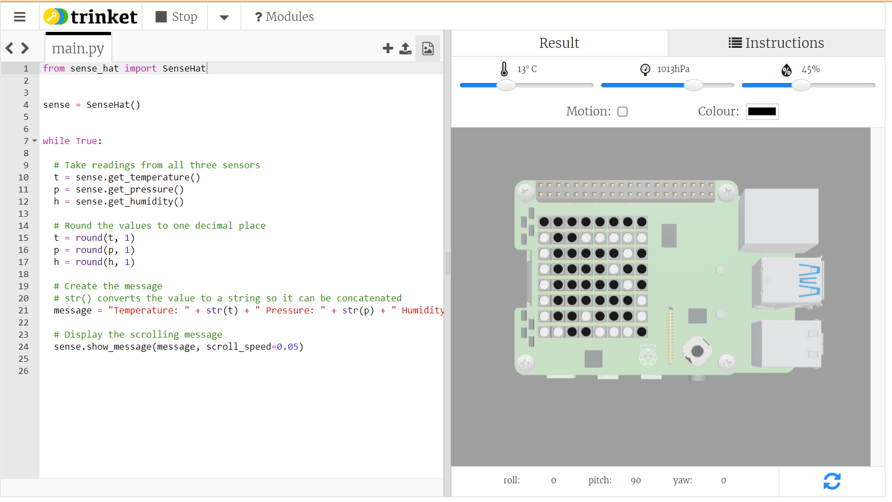

## Introduction

In this project, you will explore the sensors available on the SenseHAT and output the data in easy to read ways.

The SenseHAT is so named for all the different sensors it contains: a **Gyroscope** to tell when it is tilted, an **Accelerometer** to tell when it is moved, a **Magnetometer** to measure the magnetic radiation in the area, a **Thermometer** to measure temperature, a **Barometer** to measure the Barometric pressure, a light and colour sensor to detect ambient light and a **Hygrometer** to measure the humidity!

You will:
+ Explore the sensors and Inertial Measurement Unit (IMU)
+ Print live sensor data to the console
+ Round your data output to useful values  
+ Display the sensor data on the LED array
  
--- no-print ---
--- task ---
### Try it

  
Description of what to do or think about when looking at the example.

  <iframe src="https://trinket.io/embed/python/0102291d9e?outputOnly=true&runOption=run&start=result" width="100%" height="600" frameborder="0" marginwidth="0" marginheight="0" allowfullscreen></iframe>

--- /task ---
--- /no-print ---

--- print-only ---

--- /print-only ---
